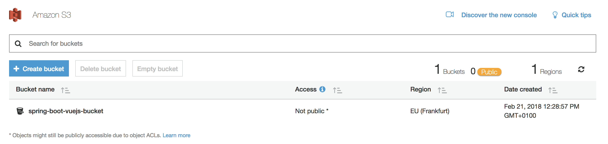
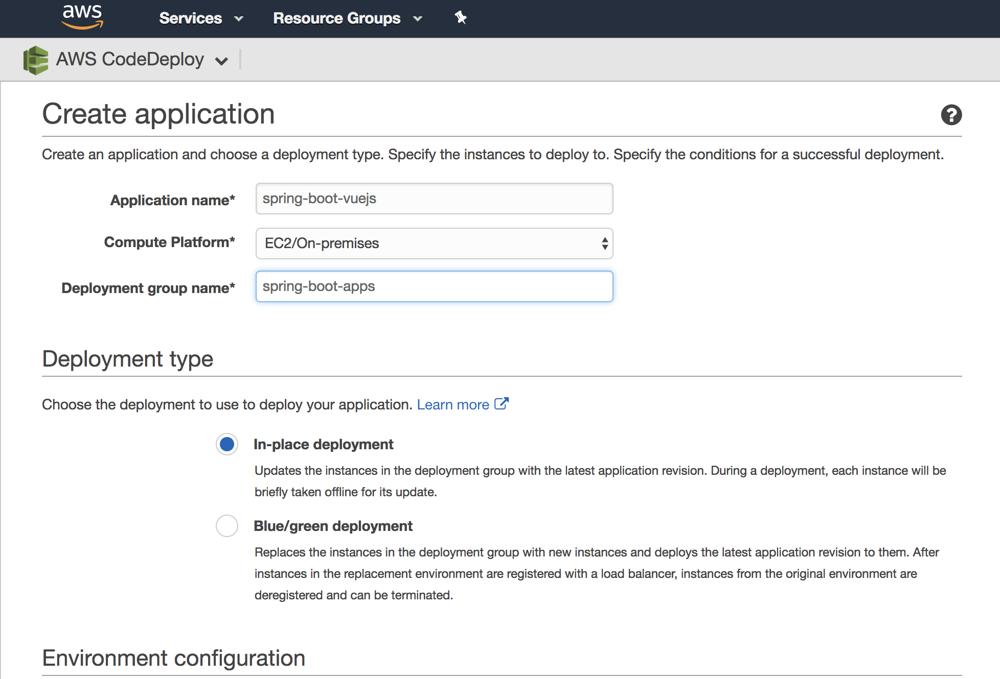
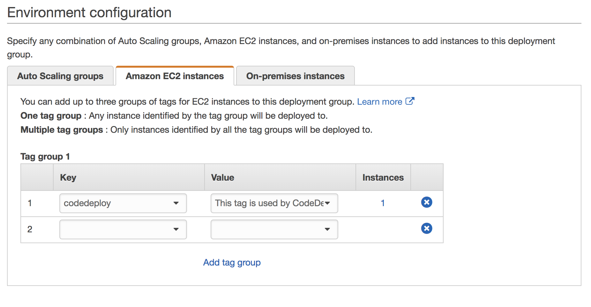

# aws-codedeploy-springboot
Example project showing how to deploy a Spring Boot app to AWS with Amazon CodeDeploy


## What do we want to do?

Assume we have a Spring Boot app that we want to deploy to AWS with the help of TravisCI and an fully automated Infrastructure-as-Code style. What options do we have?

## Amazon CodeDeploy

https://docs.aws.amazon.com/codedeploy/latest/userguide/welcome.html

#### Prerequisites

https://docs.aws.amazon.com/codedeploy/latest/userguide/getting-started-codedeploy.html

###### Create awscodedeploy Policy

First create a new Policy `awscodedeploy` at https://console.aws.amazon.com/iam/home#/policies with the following JSON (for more info, see https://docs.aws.amazon.com/codedeploy/latest/userguide/getting-started-provision-user.html):

```
{
  "Version": "2012-10-17",
  "Statement" : [
    {
      "Effect" : "Allow",
      "Action" : [
        "autoscaling:*",
        "cloudformation:*",
        "codedeploy:*",
        "ec2:*",
        "lambda:*",
        "elasticloadbalancing:*",
        "iam:AddRoleToInstanceProfile",
        "iam:CreateInstanceProfile",
        "iam:CreateRole",
        "iam:DeleteInstanceProfile",
        "iam:DeleteRole",
        "iam:DeleteRolePolicy",
        "iam:GetInstanceProfile",
        "iam:GetRole",
        "iam:GetRolePolicy",
        "iam:ListInstanceProfilesForRole",
        "iam:ListRolePolicies",
        "iam:ListRoles",
        "iam:PassRole",
        "iam:PutRolePolicy",
        "iam:RemoveRoleFromInstanceProfile", 
        "s3:*"
      ],
      "Resource" : "*"
    }    
  ]
}
```

###### Create a IAM User (don´t use your AWS root account)

Go to https://console.aws.amazon.com/iam/ and add a new User - here `aws-codedeploy-springboot` with programmatic access enabled. Go next and add the new User to the group `codedeploy` with the formerly created policy type `awscodedeploy`.

###### Install & configure AWS CLI 

(details https://docs.aws.amazon.com/codedeploy/latest/userguide/getting-started-configure-cli.html)

* `brew install awscli`

* open new console and then type `aws configure`

* get the access key ID and secret access key for an IAM user from the formerly created IAM user at the console https://console.aws.amazon.com/iam/

* choose a appropriate the CodeDeploy supported regions (https://docs.aws.amazon.com/general/latest/gr/rande.html#codedeploy_region) - I wanted to go with Frankfurt/EU, so I chose `eu-central-1`

* select the default output format with typing `json`


##### Create two TravisCI Policies

__Travis-Deploy-To-S3__

Go to https://console.aws.amazon.com/iam/home#/policies and create another policy called `Travis-Deploy-To-S3` with the following config:

```
{
    "Version": "2012-10-17",
    "Statement": [
        {
            "Effect": "Allow",
            "Action": [
                "s3:PutObject"
            ],
            "Resource": [
                "*"
            ]
        }
    ]
}
```

__Travis-Code-Deploy-Policy__

This one is tricky. Insert your server region (like `eu-central-1`) and your Account-Id (from the IAM dashboard https://console.aws.amazon.com/iam/home#/home, the first numbers from https://0123456789010.signin.aws.amazon.com/console directly beneath `IAM users sign-in link:`).

Also edit the `NameOfTheCodeDeployApplicationNameHERE` to your app´s name, like `spring-boot-vuejs`.

```
{
    "Version": "2012-10-17",
    "Statement": [
        {
            "Effect": "Allow",
            "Action": [
                "codedeploy:RegisterApplicationRevision",
                "codedeploy:GetApplicationRevision"
            ],
            "Resource": [
                "arn:aws:codedeploy:ServerRegionHERE:AccIdHERE:application:NameOfTheCodeDeployApplicationNameHERE"
            ]
        },
        {
            "Effect": "Allow",
            "Action": [
                "codedeploy:CreateDeployment",
                "codedeploy:GetDeployment"
            ],
            "Resource": [
                "*"
            ]
        },
        {
            "Effect": "Allow",
            "Action": [
                "codedeploy:GetDeploymentConfig"
            ],
            "Resource": [
                "arn:aws:codedeploy:ServerRegionHERE:AccIdHERE:deploymentconfig:CodeDeployDefault.OneAtATime",
                "arn:aws:codedeploy:ServerRegionHERE:AccIdHERE:deploymentconfig:CodeDeployDefault.HalfAtATime",
                "arn:aws:codedeploy:ServerRegionHERE:AccIdHERE:deploymentconfig:CodeDeployDefault.AllAtOnce"
            ]
        }
    ]
}
```


##### Create Travis user and group, with both Policies attached

Go to https://console.aws.amazon.com/iam/ and add a new User - here `Travis` with programmatic access enabled. Go next and add the user to a new group `Travis` and select both Travis Policies  `Travis-Deploy-To-S3` and `Travis-Code-Deploy-Policy`.

Note the Access key ID and the Secret access key somewhere safe.


##### Create a Service Role for AWS CodeDeploy

(more info https://docs.aws.amazon.com/codedeploy/latest/userguide/getting-started-create-service-role.html)

Go to https://console.aws.amazon.com/iam/ again and create a new Role. Select `CodeDeploy` under `Select your use case` below `AWS service`. Then next:Permissions - and the `AWSCodeDeployRole` Policy should show up. Then next:Review and type a Role name, like `CodeDeployServiceRole`.

If you want to restrict the ServiceRole even more, see https://docs.aws.amazon.com/codedeploy/latest/userguide/getting-started-create-service-role.html


##### Create a Service Role for our EC2 instance

Go to https://console.aws.amazon.com/iam/ again and create a new Role. Select `EC2` under `Select your use case` below `AWS service`. 

Then next:Permissions - and select the formerly created `awscodedeploy` Policy. Then next:Review and type a Role name, like `CodeDeploy-EC2-deploy-instance`.


##### Create EC2 instance (Ubuntu 14.04 LTS)

On your Main AWS dashboard click the big blue button __Launch Instance__. Now select e.g. `Ubuntu Server 14.04 LTS (HVM), SSD Volume Type` as AMI. Then select the "Free tier eligible" __t2.micro__ and don´t click the blue "Review and Lauch", instead click on __Next:Configure Instance Details__.

Be sure to __NOW__ select the pre-created IAM Service Role `CodeDeploy-EC2-deploy-instance` (you can´t do this step later on an existing EC2 instance!). Now click __Next:Add Storage__ and leave everything and click __Next:Add Tags__. Add a Tag for CodeDeploy to reference, like `codedeploy` as key and `This tag is used by CodeDeploy for... deployment`. 

Next configure 2 Security Groups: SSH (just click add Rule) and a Custom TCP Rule with port 8088 for our app.

Now click __Review and Launch__. (Don´t forget to download the keypair for later access of the instance)


##### Create S3 Bucket

Click on "Services" on top of the AWS console and type `S3` and click on it. Click `Create Bucket` button and type a name like `spring-boot-vuejs-bucket`. Overgo `Set properties` and `Set permissions` and then click `Create Bucket`. Should look like this:



##### Configure Amazon CodeDeploy

Click on "Services" on top of the AWS console and type `CodeDeploy` and click on it. Click on "Get Started Now" and choose the `custom deployment`/Skip Walkthrough. Type in an application name like `spring-boot-vuejs` (remember the NameOfTheCodeDeployApplicationNameHERE from the Travis-Code-Deploy-Policy) and a Deployment group name, like `spring-boot-apps`.



Select our EC2 instances with the configured Tag:



Now select the Service Role `CodeDeployServiceRole` we created:

 

And finally click on `Create Application`.

##### configure .travis.yml 

* Install Travis CLI

* Encrypt Secret access key: `travis encrypt --add deploy.secret_access_key`

Edit https://github.com/jonashackt/spring-boot-vuejs/blob/master/.travis.yml and add `deploy` section. Also insert your data accordingly:

* bucket
* region
* repo - your github Repo name incl. orga here


```
deploy:
- provider: s3
  access_key_id: $AWS_ACCESS_KEY
  secret_access_key: $AWS_SECRET_KEY
  local_dir: dpl_cd_upload
  skip_cleanup: true
  on: &2
    repo: organization/reponameHERE
  bucket: yourBucketNameHERE
  region: bucketRegionHERE
- provider: codedeploy
  access_key_id: $AWS_ACCESS_KEY
  secret_access_key: $AWS_SECRET_KEY
  bucket: yourBucketNameHERE
  key: latest.zip
  bundle_type: zip
  application: NameOfTheCodeDeployApplicationNameHERE
  deployment_group: CodeDeployDeploymentGroupNameHERE
  region: serverRegionHERE
  on: *2
```


Just push the new .travis.yml to your GitHub repo and have a look into the Travis console, it should look like this:

 


##### Connect to your EC2 instance
see https://docs.aws.amazon.com/de_de/AWSEC2/latest/UserGuide/AccessingInstancesLinux.html

* change permissions of your .pem file

chmod 400 /path/my-key-pair.pem

* ssh into EC2 instance (root for Ubuntu)

ssh -i spring-boot-vuejs.pem ubuntu@YOUR_INSTANCE_NAME.eu-central-1.compute.amazonaws.com


##### install CodeDeploy agent on EC2 instance

see https://docs.aws.amazon.com/codedeploy/latest/userguide/codedeploy-agent-operations-install-ubuntu.html

```
sudo apt-get update
sudo apt-get install ruby2.0
sudo apt-get install wget
cd /home/ubuntu
wget https://aws-codedeploy-eu-central-1.s3.amazonaws.com/latest/install
chmod +x ./install
sudo ./install auto

# Check the agent is running fine
sudo service codedeploy-agent status 
```

##### create appspec.yml

```
version: 0.0
os: linux
files:
  - source: ./
    destination: /home/ubuntu/spring-boot-vuejs
hooks:
  ApplicationStart:
    - location: runapp.sh
      runas: ubuntu
```

##### runas.sh

```
#!/usr/bin/env bash
echo 'Starting Spring Boot app'
cd '/home/ubuntu/spring-boot-vuejs'
java -jar backend-0.0.1-SNAPSHOT.jar
```


## Problems

appspec.yml and runas.sh not copied to S3 - so they arent there for CodeDeploy

--> solution add them in a general zip https://github.com/airavata-courses/TeamApex


# Links

* TravisCI CodeDeploy integration: https://docs.travis-ci.com/user/deployment/codedeploy/


